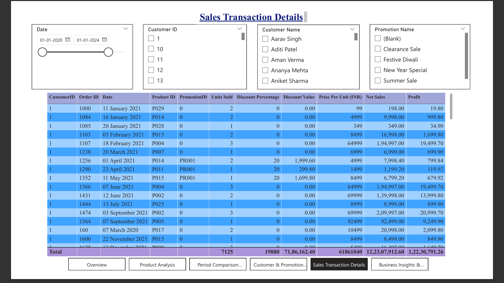

# 📊 Sales Analysis Dashboard


Interactive Power BI dashboard for sales performance analysis, customer insights, product profitability, and promotion effectiveness.

---

## 📸 Dashboard Preview


---

## 📌 Project Overview

This Power BI project provides a comprehensive sales analytics solution designed to help businesses monitor performance, evaluate promotional effectiveness, identify profitable products, and understand customer purchasing behavior.

The dashboard enables stakeholders to make data-driven decisions through interactive visualizations, KPI tracking, and detailed business insights.

---

## 🛠 Tools & Technologies

- Power BI
- DAX (Data Analysis Expressions)
- Power Query
- Data Modeling
- Data Visualization
- Business Intelligence

---

## 📂 Dataset Information

The dataset includes:

- Sales Transactions (2020–2024)
- Product Information
- Customer Information
- Promotion Details
- Revenue & Profit Metrics
- Quantity Sold
- Order-Level Data

---

## 🏗 Data Model

The dashboard follows a **Star Schema** design for optimal performance and scalability.

### Tables Used

- Fact Table
- Dim Product
- Dim Customers
- Dim Promotion
- Primary Calendar
- Comparison Calendar

### Key Features

- Optimized Relationships
- Time Intelligence Support
- Period Comparison Analysis
- Scalable Data Model Design

---

## ⚙️ Dashboard Features

- Dynamic KPI Cards
- Revenue & Profit Analysis
- Product Performance Tracking
- Promotion Effectiveness Analysis
- Customer Insights
- Period-to-Period Comparison
- Drill-Through Navigation
- Dynamic Filtering & Slicers
- Interactive Visualizations

---

## 📑 Dashboard Modules

### 1️⃣ Overview


#### Key KPIs

- Revenue
- Profit
- Orders
- Units Sold
- Margin %

---

### 2️⃣ Product Analysis


#### Insights

- Top Revenue Products
- Top Profit Products
- Lowest Revenue Products
- Lowest Profit Products
- Category Performance Analysis

---

### 3️⃣ Period Comparison Analysis


#### Features

- Dual Date Range Comparison
- Revenue Comparison
- Profit Comparison
- Quantity Comparison
- Trend Analysis

---

### 4️⃣ Customer & Promotion Analysis


#### Insights

- Top Customers by Revenue
- Top Customers by Profit
- Revenue by Promotion
- Profit by Promotion

---

### 5️⃣ Sales Transaction Details



#### Features

- Detailed Transaction Records
- Dynamic Filtering
- Drill-Through Analysis
- Customer-Level Insights
- Product-Level Insights

---

### 6️⃣ Business Insights & Recommendations


Strategic recommendations generated from sales, customer, and promotion analysis.

---

## 🔍 Key Business Insights

### Revenue Analysis

- Electronics contributes the highest share of total revenue.
- Apple iPhone 14 is the highest revenue-generating product.
- Home Appliances is the second-largest revenue-generating category.

### Profitability Analysis

- Apple iPhone 14 generates the highest overall profit.
- High-revenue products are also major profit contributors.
- Product profitability varies significantly across categories.

### Promotion Analysis

- Summer Sale generates the highest revenue.
- Summer Sale contributes the highest profit.
- Promotional campaigns have a strong influence on purchasing behavior.

### Customer Analysis

- A small group of customers contributes a significant portion of total revenue.
- Customer purchasing behavior varies across product categories and promotions.

---

## 🎯 Business Impact

This dashboard helps organizations:

- Monitor sales performance effectively
- Identify top-performing products and customers
- Evaluate promotional campaign effectiveness
- Compare business performance across different periods
- Improve decision-making through actionable insights

---

## 📈 Project Highlights

✔ Star Schema Data Model

✔ Advanced DAX Measures & KPIs

✔ Dynamic KPI Cards

✔ Interactive Filtering & Slicers

✔ Period Comparison Analysis

✔ Drill-Through Reporting

✔ Business Recommendation Framework

✔ Data-Driven Insights

✔ Professional Dashboard Design

---

## 📁 Repository Structure

```text
Sales-Analysis-PowerBI
│
├── README.md
├── Sales Analysis Dashboard.pdf
├── Sales Analysis.pbix
│
└── Screenshots
    ├── 01_Overview.png
    ├── 02_Product_Analysis.png
    ├── 03_Period_Comparison_Analysis.png
    ├── 04_Customer_Promotion_Analysis.png
    ├── 05_Sales_Transactions_Details.png
    └── 06_Business_Insights_Recommendations.png
```

---

## 🚀 How to Use

1. Download the `Sales Analysis.pbix` file.
2. Open it using Microsoft Power BI Desktop.
3. Navigate through the dashboard pages.
4. Apply filters and slicers for custom analysis.
5. Explore business insights and recommendations.

---

## 💡 Skills Demonstrated

- Power BI Dashboard Development
- DAX Calculations & Measures
- Data Modeling (Star Schema)
- Power Query Transformations
- Business Intelligence
- KPI Design & Reporting
- Data Visualization
- Analytical Thinking
- Business Insights Generation

---

## 👨‍💻 Author

**Sajjarapu Sai Kiran**

- GitHub: https://github.com/SaiKiran0078
