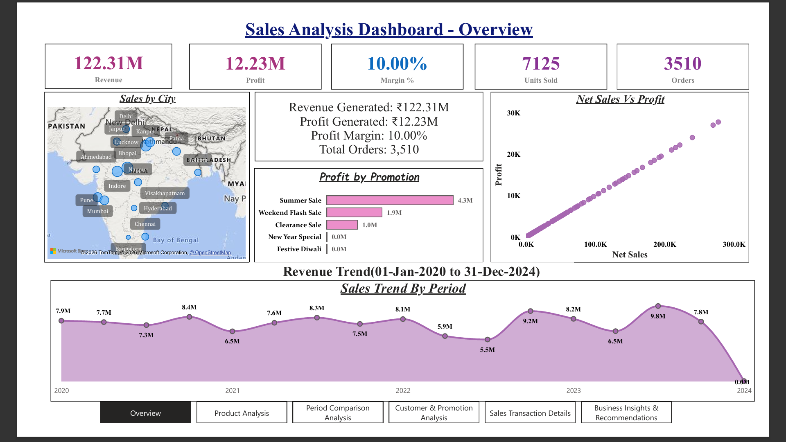
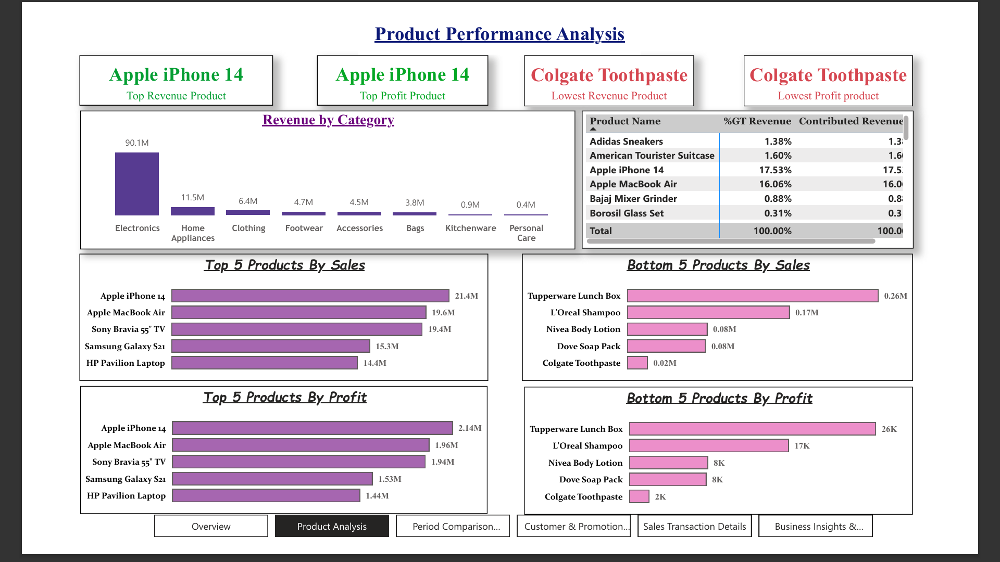
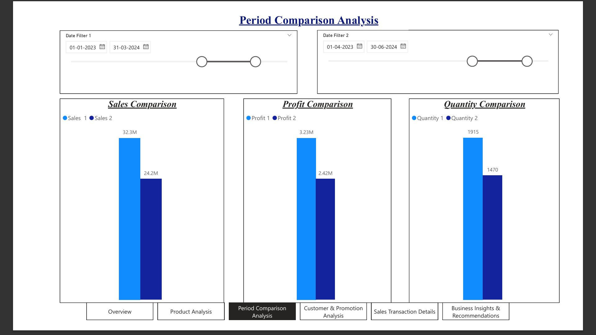
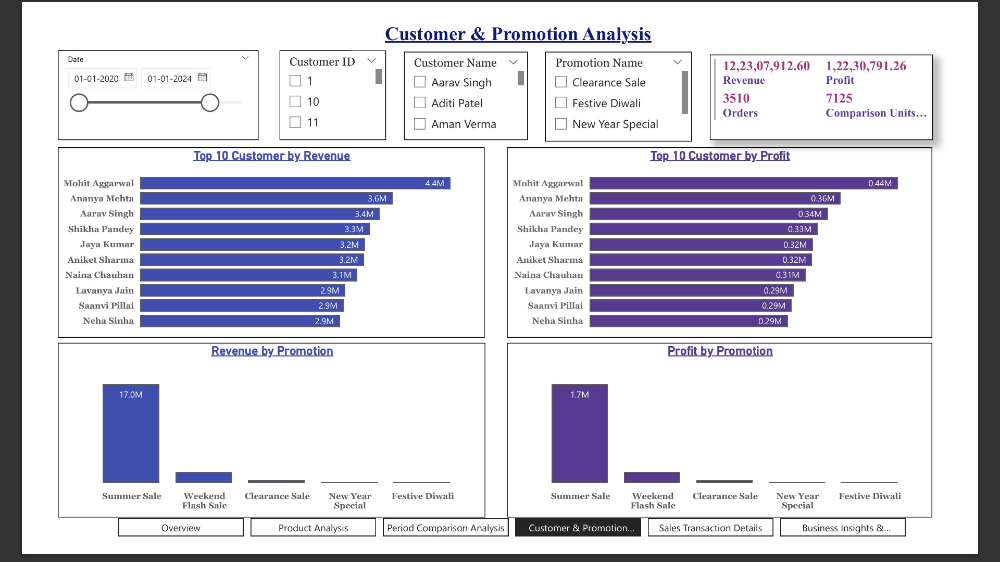
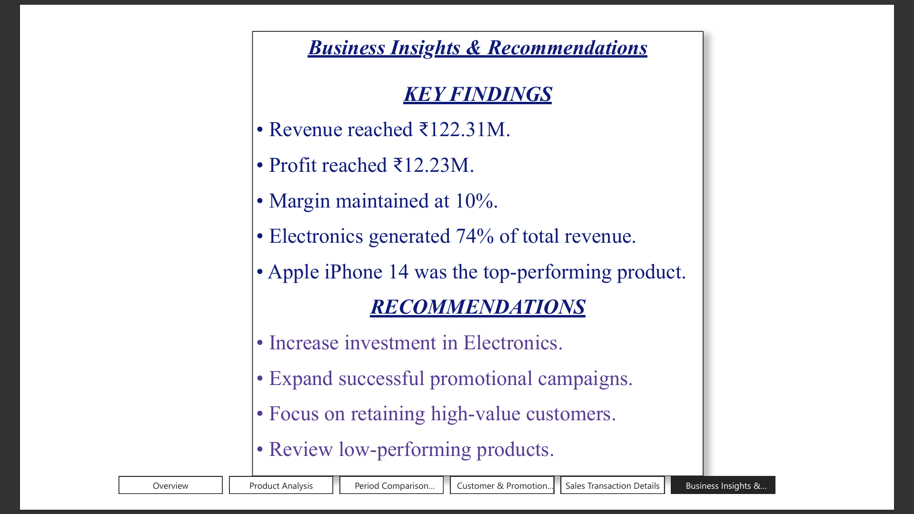

# 📊 Sales Analysis Dashboard

## 📌 Project Overview

An interactive Power BI dashboard built to analyze sales performance, customer behavior, product profitability, and promotion effectiveness.

The dashboard helps stakeholders monitor KPIs, identify top-performing products, evaluate promotions, and make data-driven decisions.

---

## 🛠 Tools & Technologies

- Power BI
- DAX
- Power Query
- Data Modeling
- Data Visualization

---

## 📂 Data Model

Star Schema Design:

- Fact Table
- Dim Product
- Dim Customers
- Dim Promotion
- Primary Calendar
- Comparison Calendar

---

## 📈 Dashboard Pages

### 1️⃣ Overview

Key KPIs:
- Revenue
- Profit
- Orders
- Units Sold
- Margin %

---

### 2️⃣ Product Analysis

Insights:
- Top Revenue Products
- Top Profit Products
- Lowest Performing Products
- Category Analysis

---

### 3️⃣ Period Comparison Analysis

Features:
- Dual Date Comparison
- Revenue Comparison
- Profit Comparison
- Quantity Comparison

---

### 4️⃣ Customer & Promotion Analysis

Insights:
- Top Customers
- Revenue by Promotion
- Profit by Promotion

---

### 5️⃣ Sales Transaction Details

Features:
- Detailed Transaction View
- Dynamic Filtering
- Drill-through Analysis

---

### 6️⃣ Business Insights & Recommendations

Strategic recommendations derived from dashboard analysis.

---

## 🔍 Key Business Insights

### Revenue

- Electronics contributes the highest share of total revenue.
- Apple iPhone 14 is the highest revenue-generating product.

### Profitability

- Apple iPhone 14 generates the highest profit.
- High-revenue products are also strong profit contributors.

### Promotions

- Summer Sale generates the highest revenue and profit.
- Promotional campaigns significantly influence customer purchases.

### Customers

- Top customers contribute a substantial portion of total revenue.

---

## 🚀 Project Highlights

✔ Star Schema Data Model

✔ DAX Measures & KPIs

✔ Dynamic Filtering

✔ Period Comparison Analysis

✔ Interactive Dashboard Design

✔ Business Recommendation Framework

---

## 👨‍💻 Author

**Sai Kiran**

GitHub: https://github.com/saiKiran0078
